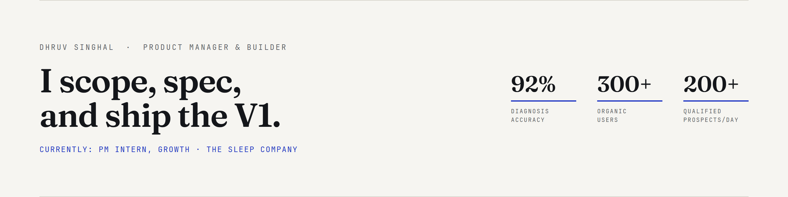
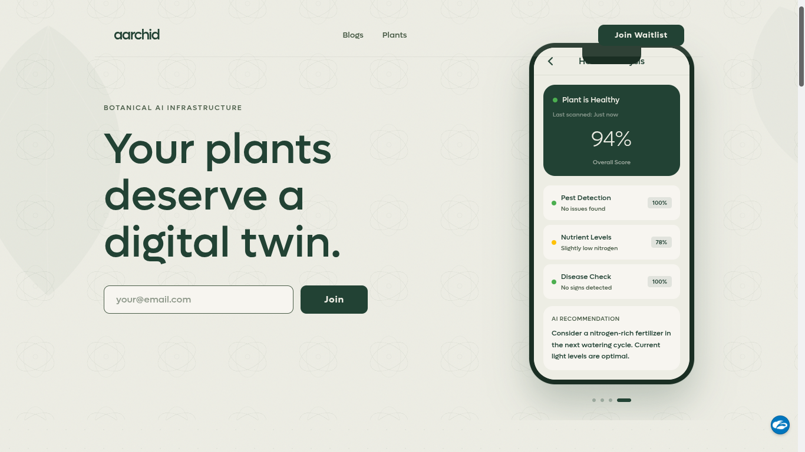
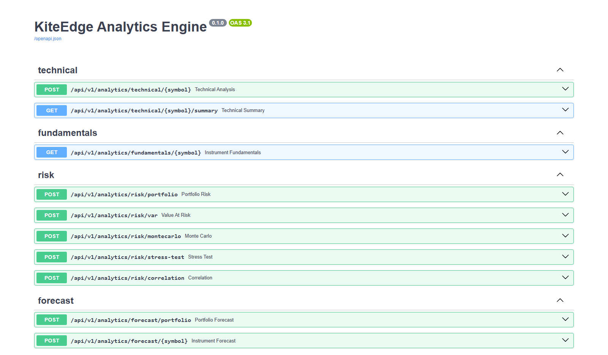
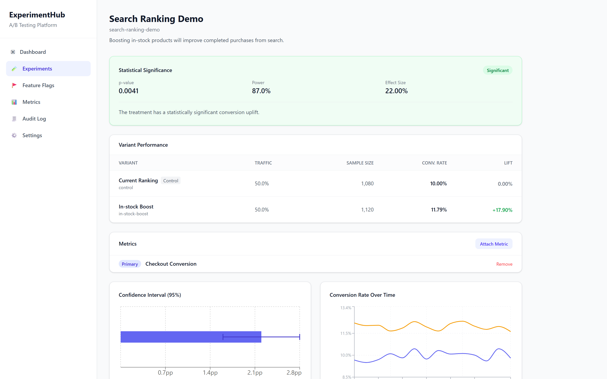

<picture>
  <source media="(prefers-color-scheme: dark)" srcset="assets/banner-dark.png">
  
</picture>

  <a href="https://dhruvsinghal.codes">Portfolio</a> •
  <a href="https://linkedin.com/in/dhruvsinghal6888">LinkedIn</a> •
  <a href="https://dhruvsinghal.codes/resume/dhruv-singhal-resume.pdf">Résumé</a> •
  <a href="mailto:dhruvsinghal6888@gmail.com">Email</a>

I turn ambiguous business and workflow problems into specs, metrics, and working
software — then keep going until the numbers move. Currently **PM Intern, Growth
at The Sleep Company**; open to **Associate PM, Product Analyst, and AI PM** roles.

Twelve projects, five of them live, nine written up as full case studies, and
eight essays on how the decisions got made — all at
[dhruvsinghal.codes](https://dhruvsinghal.codes).

---

## Selected work

<table>
<tr>
<td width="33%"></td>
<td width="33%"></td>
<td width="33%"></td>
</tr>
<tr>
<td valign="top">

**[Aarchid](https://dhruvsinghal.codes/projects/aarchid)** — AI botanical intelligence

Photograph a sick plant, get a diagnosis you can act on. **92% accuracy** on a
200-image golden set across 15 disease categories.

`Gemini 1.5 Pro` `RAG` `Cloudflare Workers`

[Live](https://www.aarchid.space/) · [Case study](https://dhruvsinghal.codes/projects/aarchid) · [API repo](https://github.com/atavisticrystal6888/aarchid-api)

</td>
<td valign="top">

**[KiteEdge](https://dhruvsinghal.codes/projects/kite-edge)** — portfolio intelligence

The analytics desk a fund gets, for a retail Zerodha trader. **43+ indicators**,
Monte Carlo VaR, ensemble forecasting, self-hosted.

`Elixir/Phoenix` `Python` `Kafka` `React`

[Case study](https://dhruvsinghal.codes/projects/kite-edge)

</td>
<td valign="top">

**[ExperimentHub](https://dhruvsinghal.codes/projects/experiment-hub)** — A/B testing platform

Experiments a team can trust on its own infrastructure. Deterministic bucketing
from a Rust MurmurHash3 core, **50+ tenant-scoped routes**.

`Elixir` `Rust` `FastAPI` `Kafka`

[Case study](https://dhruvsinghal.codes/projects/experiment-hub) · [Repo](https://github.com/atavisticrystal6888/A-B-Testing-Platform)

</td>
</tr>
</table>

**Also here:** [Hackmate](https://github.com/atavisticrystal6888/hackmate-rework) — co-founder matchmaking, 300+ organic users ·
[Customer Churn Analysis](https://github.com/atavisticrystal6888/Customer-churn-analysis) — predictive scoring, ~15% projected churn reduction ·
[This portfolio](https://github.com/atavisticrystal6888/Portfolio-v4) — [dhruvsinghal.codes](https://dhruvsinghal.codes), built as its own case study

---

## Experience

**The Sleep Company** — PM Intern, Growth · *Jul 2026 – present*
Evaluated and selected BSP, CRM, payments, OMS and WMS vendors; built AI
operational agents for internal workflows; standardised the Shopify master
catalogue and mapped end-to-end PDP flows.

**Wipro** — AI Product Intern, Wipro TOPS · *Feb – Jul 2026*
Scoped **Auriga ReX**, an internal AI workflow platform, from transcript
ingestion through governed CSS/FSBCD/URS/FSD generation. Specced the Crew Mobile
Microapp across 12+ scheduling and compliance scenarios; surfaced 3 data
integrity issues before development.

**Read Riches** — Founder's Office Intern · *Mar – Jun 2025*
Ran content-led growth experiments off engagement data, contributing to a **4x
retention improvement**, while managing a 4-person research and content team.

**Omniful.ai** — Business Analyst Intern · *Jun – Aug 2024*
Rebuilt lead scoring on 8+ firmographic and behavioural signals — qualified
prospects went from ~10/day to **200+/day**, linked to 10 B2B acquisitions.

---

## What I work with

**Product** — `discovery` `PRDs & specs` `feature scoping` `KPI design` `prioritisation` `GTM`

**Analytics** — `SQL` `Python` `Power BI` `Mixpanel` `experimentation` `cohort & funnel analysis`

**AI & build** — `RAG pipelines` `prompt evals` `model selection` `TypeScript` `Next.js` `FastAPI` `PostgreSQL`

## Writing

[Shipping LLM Products: Eval Harness](https://dhruvsinghal.codes/blog/shipping-llm-products-eval-harness) ·
[Why PMs Should Code](https://dhruvsinghal.codes/blog/why-pms-should-code) ·
[Data-Driven Product Decisions](https://dhruvsinghal.codes/blog/data-driven-product-decisions) ·
[More](https://dhruvsinghal.codes/blog)

---

3rd place, Techstars Startup Weekend (DTU) · Top 5, Smart India Hackathon · B.Tech, J.C. Bose University (YMCA), 2022–2026
